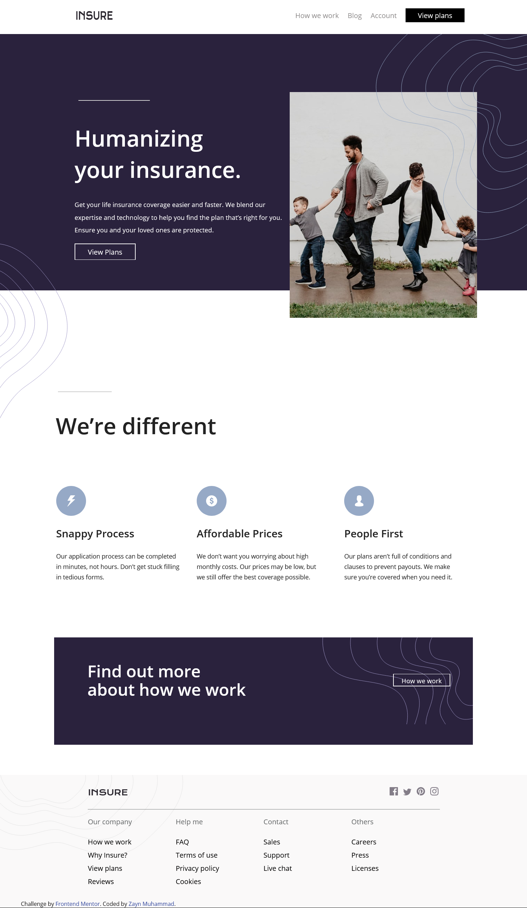

# Frontend Mentor - Insure landing page solution

This is a solution to the [Insure landing page challenge on Frontend Mentor](https://www.frontendmentor.io/challenges/insure-landing-page-uTU68JV8). Frontend Mentor challenges help you improve your coding skills by building realistic projects. 

## Table of contents

- [Overview](#overview)
  - [The challenge](#the-challenge)
  - [Screenshot](#screenshot)
  - [Links](#links)
- [My process](#my-process)
  - [Built with](#built-with)
  - [What I learned](#what-i-learned)
  - [Continued development](#continued-development)
  - [Useful resources](#useful-resources)
- [Author](#author)
- [Acknowledgments](#acknowledgments)

## Overview

### The challenge

Users should be able to:

- View the optimal layout for the site depending on their device's screen size
- See hover states for all interactive elements on the page

### Screenshot

\

### Links

- Solution URL: [Github](https://your-solution-url.com)
- Live Site URL: [Demo](https://zaynmuhammad.github.io/insure_landing_page/)

## My process

### Built with

- Semantic HTML5 markup
- CSS custom properties
- Flexbox
- CSS Grid
- Mobile-first workflow
- SASS/SCSS (https://sass-lang.com/)

### What I learned

I used a mobile first design approach using the SCSS library and gulp to convert my SCSS files to CSS.
Using a mobile first design apporach is a lot simpler than a desktop first approach. Mobile is often a lot simpler
to design than desktop so adding complexity to a design is WAY easier than removing complex CSS rules and functionality.
Using a preprocessor like SCSS is also really nice and I prefer it to using plain CSS. I also made a comparison of
using CSS grid and the position attribute, and discovered that CSS grid is far easier to use and understand than
then position attribute. Also, grid is much more responsive, so in the future I will use grid whenever possible.

### Continued development

I will keep practicing using SCSS and grid as they are tools that make front-end developing so much easier. I would like to incorporate
something like Bootstrap in my next project to gain more experience with that. I will also like to work with using more media queries,
I only added media queries for when there were major breaks in the page layout, so I would like to further experiment with that.

### Useful resources

- [Sass-boilerplate](https://github.com/KittyGiraudel/sass-boilerplate) - Really nice for setting up my SCSS using a 7-1 file layout.
- [CSS grid](https://css-tricks.com/snippets/css/complete-guide-grid/) - Great for looking up grid rules

## Author

- Website - [Zayn Muhammad](zaynmuhammad.netlify.app/)
- Frontend Mentor - [@ZaynMuhammad](https://www.frontendmentor.io/profile/ZaynMuhammad)
